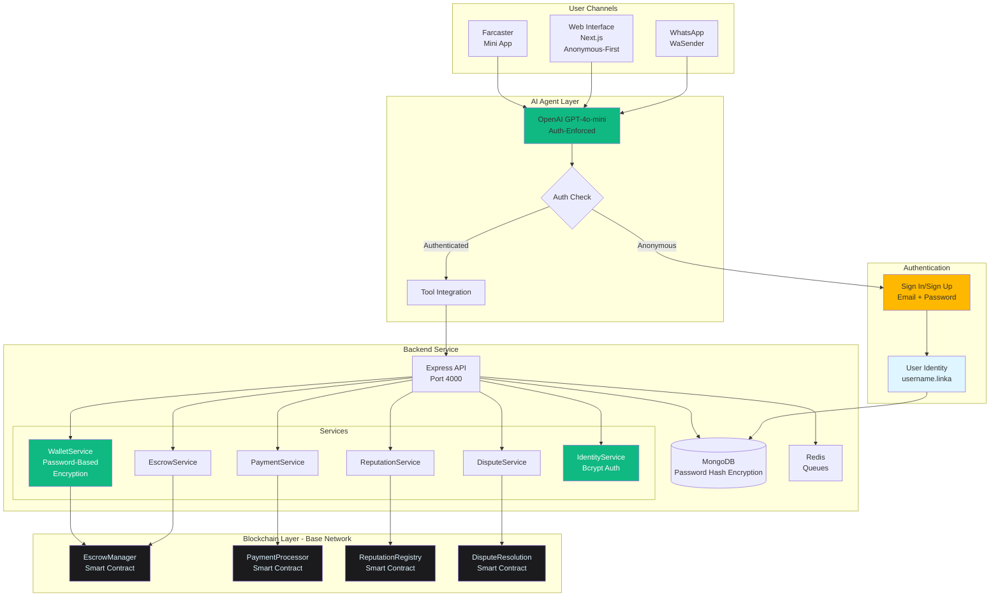

```mermaid
graph TB
    subgraph "User Channels"
        WA[WhatsApp<br/>WaSender]
        WEB[Web Interface<br/>Next.js<br/>Anonymous-First]
        FC[Farcaster<br/>Mini App]
    end

    subgraph "AI Agent Layer"
        AGENT[OpenAI GPT-4o-mini<br/>Auth-Enforced]
        AUTH_CHECK{Auth Check}
        TOOLS[Tool Integration]
    end

    subgraph "Authentication"
        AUTH[Sign In/Sign Up<br/>Email + Password]
        USER[User Identity<br/>username.linka]
    end

    subgraph "Backend Service"
        API[Express API<br/>Port 4000]
        DB[(MongoDB<br/>Password Hash Encryption)]
        RQ[Redis<br/>Queues]
        
        subgraph "Services"
            ES[EscrowService]
            PS[PaymentService]
            RS[ReputationService]
            DS[DisputeService]
            WS[WalletService<br/>Password-Based<br/>Encryption]
            IS[IdentityService<br/>Bcrypt Auth]
        end
    end

    subgraph "Blockchain Layer - Base Network"
        EM[EscrowManager<br/>Smart Contract]
        PP[PaymentProcessor<br/>Smart Contract]
        RR[ReputationRegistry<br/>Smart Contract]
        DR[DisputeResolution<br/>Smart Contract]
    end

    WA --> AGENT
    WEB --> AGENT
    FC --> AGENT

    AGENT --> AUTH_CHECK
    AUTH_CHECK -->|Authenticated| TOOLS
    AUTH_CHECK -->|Anonymous| AUTH
    AUTH --> USER
    USER --> DB

    TOOLS --> API

    API --> ES
    API --> PS
    API --> RS
    API --> DS
    API --> WS
    API --> IS
    
    API --> DB
    API --> RQ

    ES --> EM
    PS --> PP
    RS --> RR
    DS --> DR
    WS --> EM

    style AGENT fill:#10B981
    style AUTH fill:#FFB800
    style USER fill:#DFF5FF
    style WS fill:#10B981,color:#fff
    style IS fill:#10B981,color:#fff
    style EM fill:#1B1B1E,color:#DFF5FF
    style PP fill:#1B1B1E,color:#DFF5FF
    style RR fill:#1B1B1E,color:#DFF5FF
    style DR fill:#1B1B1E,color:#DFF5FF
```

