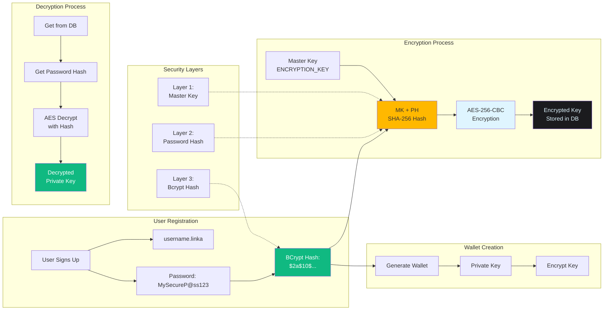

```mermaid
graph LR
    subgraph "User Registration"
        U[User Signs Up]
        P[Password: MySecureP@ss123]
        PH[BCrypt Hash:<br/>$2a$10$...]
        UN[username.linka]
    end

    subgraph "Wallet Creation"
        W[Generate Wallet]
        PK[Private Key]
        EK[Encrypt Key]
    end

    subgraph "Encryption Process"
        MK[Master Key<br/>ENCRYPTION_KEY]
        COMBINE[MK + PH<br/>SHA-256 Hash]
        AES[AES-256-CBC<br/>Encryption]
        STORE[Encrypted Key<br/>Stored in DB]
    end

    subgraph "Decryption Process"
        RETRIEVE[Get from DB]
        GET_HASH[Get Password Hash]
        DECRYPT[AES Decrypt<br/>with Hash]
        DEC_PK[Decrypted<br/>Private Key]
    end

    subgraph "Security Layers"
        L1[Layer 1:<br/>Master Key]
        L2[Layer 2:<br/>Password Hash]
        L3[Layer 3:<br/>Bcrypt Hash]
    end

    U --> P
    P --> PH
    U --> UN
    
    PH --> W
    W --> PK
    PK --> EK
    
    MK --> COMBINE
    PH --> COMBINE
    COMBINE --> AES
    AES --> STORE
    
    RETRIEVE --> GET_HASH
    GET_HASH --> DECRYPT
    DECRYPT --> DEC_PK
    
    L1 -.-> COMBINE
    L2 -.-> COMBINE
    L3 -.-> PH

    style PH fill:#10B981,color:#fff
    style COMBINE fill:#FFB800
    style AES fill:#DFF5FF
    style STORE fill:#1B1B1E,color:#DFF5FF
    style DEC_PK fill:#10B981,color:#fff
```
