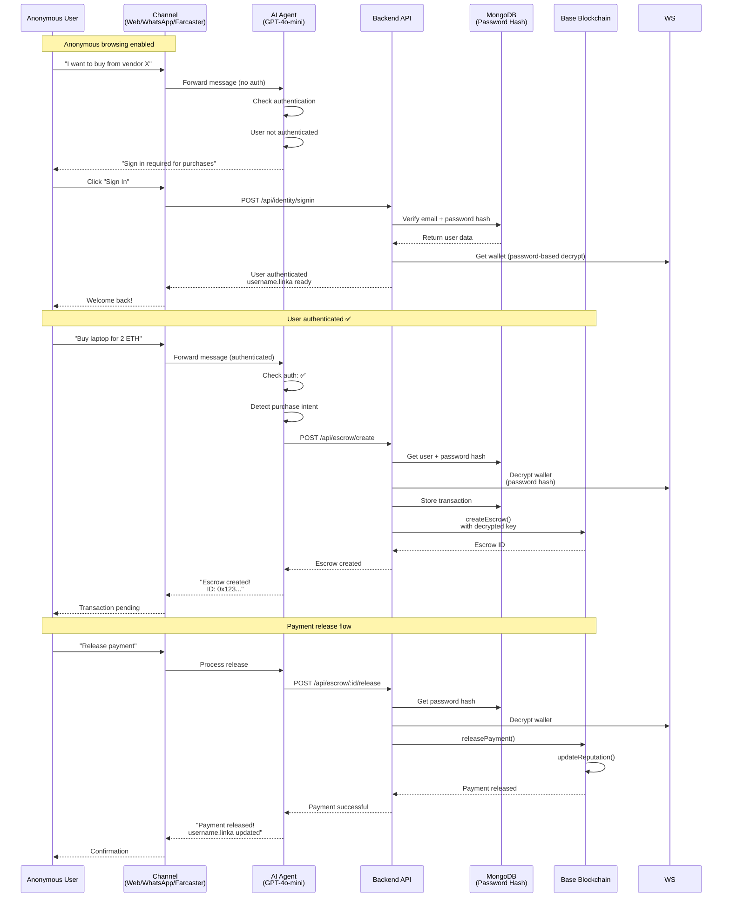

```mermaid
sequenceDiagram
    participant U as Anonymous User
    participant C as Channel<br/>(Web/WhatsApp/Farcaster)
    participant AI as AI Agent<br/>(GPT-4o-mini)
    participant API as Backend API
    participant DB as MongoDB<br/>(Password Hash)
    participant BC as Base Blockchain

    Note over U,C: Anonymous browsing enabled
    U->>C: "I want to buy from vendor X"
    C->>AI: Forward message (no auth)
    
    AI->>AI: Check authentication
    AI->>AI: User not authenticated
    AI-->>U: "Sign in required for purchases"
    
    U->>C: Click "Sign In"
    C->>API: POST /api/identity/signin
    API->>DB: Verify email + password hash
    DB-->>API: Return user data
    API->>WS: Get wallet (password-based decrypt)
    API-->>C: User authenticated<br/>username.linka ready
    C-->>U: Welcome back!
    
    Note over U,BC: User authenticated ✅
    U->>C: "Buy laptop for 2 ETH"
    C->>AI: Forward message (authenticated)
    
    AI->>AI: Check auth: ✅
    AI->>AI: Detect purchase intent
    AI->>API: POST /api/escrow/create
    
    API->>DB: Get user + password hash
    API->>WS: Decrypt wallet<br/>(password hash)
    API->>DB: Store transaction
    
    API->>BC: createEscrow()<br/>with decrypted key
    BC-->>API: Escrow ID
    API-->>AI: Escrow created
    AI-->>C: "Escrow created!<br/>ID: 0x123..."
    C-->>U: Transaction pending
    
    Note over U,BC: Payment release flow
    U->>C: "Release payment"
    C->>AI: Process release
    AI->>API: POST /api/escrow/:id/release
    
    API->>DB: Get password hash
    API->>WS: Decrypt wallet
    API->>BC: releasePayment()
    BC->>BC: updateReputation()
    BC-->>API: Payment released
    API-->>AI: Payment successful
    AI-->>C: "Payment released!<br/>username.linka updated"
    C-->>U: Confirmation
```